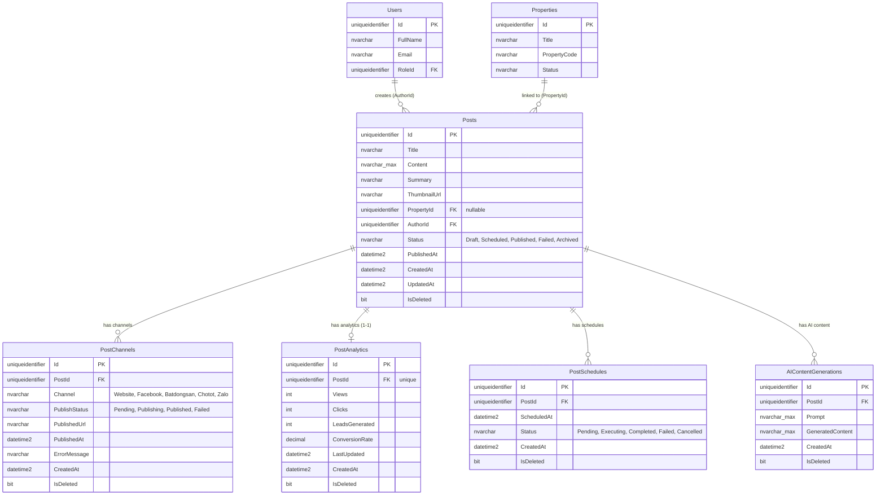

# 📊 ERD — Posting Module

> Entity Relationship Diagram cho module Posting Management.

---

## Diagram

---

## Relationships

| Parent | Child | Type | FK | Delete Behavior |
|--------|-------|------|----|-----------------|
| Users | Posts | 1-N | AuthorId | Restrict |
| Properties | Posts | 1-N | PropertyId (nullable) | SetNull |
| Posts | PostChannels | 1-N | PostId | Cascade |
| Posts | PostAnalytics | 1-1 | PostId (unique) | Cascade |
| Posts | PostSchedules | 1-N | PostId | Cascade |
| Posts | AIContentGenerations | 1-N | PostId | Cascade |

---

## Indexes

| Table | Column(s) | Type |
|-------|-----------|------|
| Posts | Status | Index |
| Posts | AuthorId | Index |
| Posts | PropertyId | Index |
| Posts | PublishedAt | Index |
| Posts | CreatedAt | Index |
| PostChannels | PostId | Index |
| PostChannels | Channel | Index |
| PostChannels | PublishStatus | Index |
| PostAnalytics | PostId | Unique Index |
| PostSchedules | PostId | Index |
| PostSchedules | ScheduledAt | Index |
| PostSchedules | Status | Index |
| AIContentGenerations | PostId | Index |
| AIContentGenerations | CreatedAt | Index |

---

> **Version**: 1.0.0
> **Last Updated**: 2026-06-02
