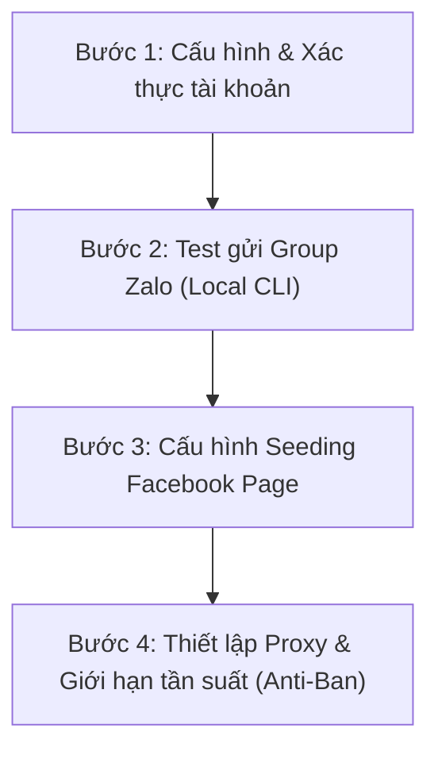

# Real Estate Auto-Posting Integration Plan

Dự án **RealSync** hiện đang có sẵn các thư viện/công cụ tự động hóa mạnh mẽ trong thư mục `agent-skills`. Kế hoạch này đề xuất tích hợp các công cụ này vào Backend C# để tự động đăng bài, đồng thời đánh giá giải pháp dưới góc nhìn của nhà quản lý/marketing bất động sản và cung cấp lộ trình thử nghiệm đăng bài vào các Group (Zalo, Facebook).

---

## 1. 📈 Đánh giá từ góc nhìn Marketing & Ban Giám đốc BĐS

Nếu đặt địa vị là một **Giám đốc Marketing (CMO)** hoặc **Chủ tịch/Giám đốc công ty BĐS**, dưới đây là đánh giá chi tiết về hệ thống tool hiện có:

### Điểm mạnh (Ready for Production)
* **Tiếp cận đa kênh tối ưu cho thị trường Việt Nam**: Sự kết hợp giữa `zalo-agent-cli` (cho nhóm Zalo) và `social-auto-engine` (Facebook, Instagram, Youtube, Tiktok) bao phủ gần như 95% kênh tương tác của khách hàng và môi giới BĐS tại Việt Nam.
* **Đăng bài nhóm Zalo (Zalo Groups)**: Đây là kênh cực kỳ quan trọng đối với môi giới BĐS để "lùa gà" hoặc chia sẻ rổ hàng (co-brokerage). Tool Zalo CLI qua cơ chế ZCA hỗ trợ gửi tin nhắn kèm hình ảnh/link trực tiếp vào Group qua `threadId`.
* **Quản lý đa tài khoản & Proxy**: Việc hỗ trợ Proxy 1:1 trong Zalo và quản lý token đa kênh giúp doanh nghiệp mở rộng quy mô (mỗi nhân viên sales sở hữu 5-10 nick clone tự động seeding mà không lo bị trùng IP dẫn tới quét hàng loạt).

### Điểm yếu & Lỗ hổng cần bổ sung (Gaps)
* **Hạn chế đăng bài Facebook Group (Cực kỳ quan trọng)**:
  * *Hiện tại*: `social-auto-engine` đang dùng Facebook Graph API chính thức để đăng lên **Page** (Trang). Facebook API hiện tại **không cho phép** đăng bài tự động lên các Group công cộng (như *Chợ đất Quận 2, Hội cư dân Vinhomes...*) trừ khi App Facebook được phê duyệt khắt khe và được Admin Group cài đặt thủ công.
  * *Giải pháp khắc phục*: Để Marketing BĐS tiếp cận hàng trăm Group rác/seeding, bắt buộc phải bổ sung cơ chế đăng bài bằng **Trình duyệt tự động (Browser Automation via Playwright/Puppeteer)** sử dụng cookie của tài khoản cá nhân thay vì API chính thức.
* **Thiếu kênh đăng tin chuyên trang BĐS**: Môi giới BĐS tại Việt Nam cần đăng tin lên `batdongsan.com.vn`, `chotot.com`, `alonhadat.com.vn`. Tool hiện tại chưa hỗ trợ các kênh này.

### Đánh giá mức độ đáp ứng: **8/10** (Đủ điều kiện chạy Beta, cần nâng cấp Browser Automation cho FB Group).

---

## 2. 🛠️ Đề xuất tích hợp kỹ thuật vào Backend C#

Chúng ta sẽ nâng cấp hàm thực tế [PublishAsync](file:///d:/A/RealSync/backend/src/RealSync.Services/Implementations/PostChannelService.cs#L87-L100) trong `PostChannelService.cs` thay vì chỉ mô phỏng (Simulate) trạng thái:

```
[Frontend UI: Publish Click]
            │
            ▼
[Backend: PostChannelService.PublishAsync]
            │
            ├─► Nếu Channel == "zalo" ──────► Chạy zalo-agent-cli (gửi tin nhắn/hình ảnh tới Thread ID)
            │
            └─► Nếu Channel == "facebook" ──► Gọi python manager.py hoặc API của social-auto-engine
```

### Chi tiết thay đổi mã nguồn

#### [MODIFY] [PostChannelService.cs](file:///d:/A/RealSync/backend/src/RealSync.Services/Implementations/PostChannelService.cs)
* Bổ sung cơ chế gọi CLI tiến trình cho `zalo-agent` và `python` tương tự như cách gọi `opencode`.
* Tự động lấy nội dung bài viết từ bảng `Post` (trường `Content` hoặc bài AI generate gần nhất) và hình ảnh đính kèm để đẩy lên kênh tương ứng.

---

## 3. 🎯 Lộ trình kiểm thử đăng bài vào Group (Zalo & Facebook)

Dưới đây là lộ trình 4 bước để bạn chạy thử nghiệm đăng bài trực tiếp từ máy tính lên các Group nhằm đánh giá hiệu quả:



### 📋 Chi tiết các bước thực hiện

### Bước 1: Cấu hình & Xác thực tài khoản (Authentication)
* **Zalo**:
  1. Mở Terminal tại thư mục gốc dự án.
  2. Chạy lệnh đăng nhập QR:
     ```bash
     npx zalo-agent-cli login
     ```
  3. Quét mã bằng App Zalo điện thoại để xác thực. Thiết bị local của bạn sẽ được lưu session an toàn.
* **Facebook**:
  1. Truy cập [Facebook Developer Portal](https://developers.facebook.com/).
  2. Lấy **Page Access Token** và cấu hình vào file `.env` tại thư mục `agent-skills/social-auto-engine/.env`.

### Bước 2: Test gửi bài vào Group Zalo (Zalo Groups)
1. Kích hoạt chế độ lắng nghe của zalo-agent để lấy mã nhận diện (ID) của Group cần test:
   ```bash
   npx zalo-agent-cli listen
   ```
2. Hãy gửi một tin nhắn bất kỳ vào Group Zalo đó từ điện thoại. Terminal sẽ hiển thị log dạng JSON, hãy copy giá trị `threadId` của nhóm đó (ví dụ: `g123456789`).
3. Thực hiện gửi thử bài đăng kèm ảnh từ database BĐS vào Group đó:
   ```bash
   npx zalo-agent-cli msg send "g123456789" "🔥 Căn hộ view sông Thủ Thiêm giá cực sốc! LH 090xxxxxx"
   ```
4. Kiểm tra điện thoại xem tin nhắn đã xuất hiện trong nhóm chưa.

### Bước 3: Cấu hình đăng bài Facebook Page
1. Do hạn chế của Facebook Graph API đối với Group, bước này chúng ta sẽ kiểm tra việc đăng tự động lên **Page vệ tinh** trước để test API.
2. Chạy thử script Python đăng tin BĐS lên Page:
   ```bash
   python agent-skills/social-auto-engine/manager.py --action post --message "Nội dung tin đăng BĐS..."
   ```

### Bước 4: Thiết lập Proxy và Giới hạn chống Spam (Anti-Ban)
> [!WARNING]
> Zalo và Facebook quét spam rất gắt gao. Để chạy tool tự động hàng ngày:
> 1. Mỗi tài khoản Zalo seeding nên chạy qua 1 Proxy HTTP riêng (Cấu hình trong lệnh `zalo-agent account add --proxy`).
> 2. Giãn cách thời gian giữa các bài đăng tối thiểu 5-10 phút.
> 3. Không dùng từ khóa nhạy cảm bị bộ lọc Zalo chặn.

---

## 4. ❓ Câu hỏi thảo luận

> [!IMPORTANT]
> Vui lòng cho biết bạn muốn tích hợp đăng lên **Zalo Group** (Sử dụng nick Zalo cá nhân quét mã QR để đi rải bài trong các hội nhóm môi giới) hay **Facebook Page** trước? 
> Hãy duyệt qua kế hoạch này để chúng tôi bắt đầu triển khai mã nguồn cụ thể trong Backend C#.
